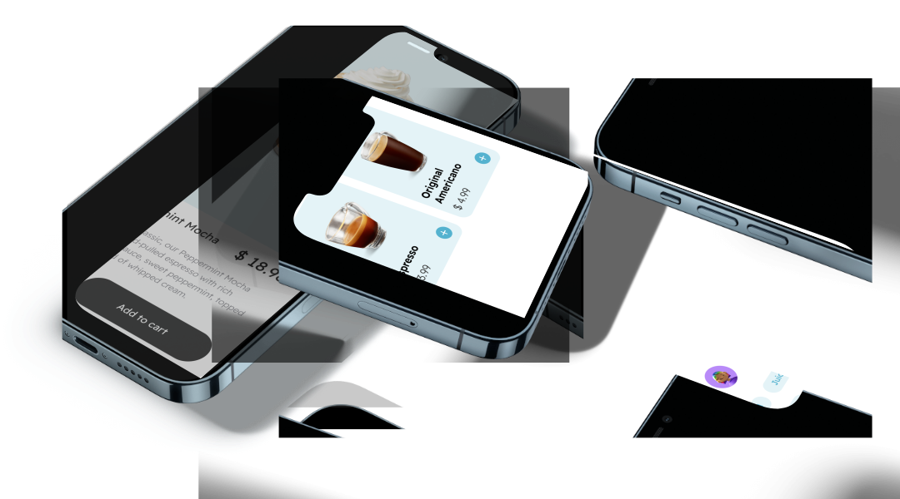

<h1 align="center">Veroo</h1>

  
  
  

Veroo is a cappuccino delivery app. This application is for the purpose of studying modern interface and animations.

 

<h2 align="center">Pleasant, fluid and lively experience</h2>

Have a captivating experience that sparks emotion when using.

## 🚀 Technologies
The following technologies were used for the development of the application.

